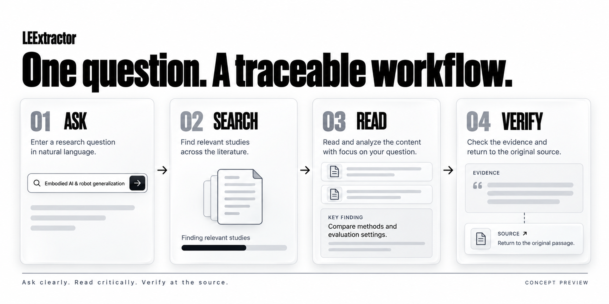

<div align="center">

# LEExtractor

[简体中文](README.zh-CN.md) · **English**

**From research questions to traceable evidence.**

Search literature. Trace evidence. Build understanding.

<p>
  
  
</p>

[Preview](#preview) · [Core experience](#experience) · [Get started](#start) · [Roadmap](#roadmap) · [Contributing](#contributing)

</div>

<br>

<p align="center">
  
</p>

<p align="center"><sub>Product concept preview · Publications and results shown in the interface are illustrative</sub></p>

---

LEExtractor is designed for literature exploration and research evidence organization. Its workflow connects the steps of asking a research question, finding relevant publications, reading key findings, and tracing them back to supporting passages and original sources.

**Give every finding a source you can revisit.**

> This README presents the product concept and proposed workflow. Available builds, installation instructions, and implementation status will be added with the first release.

<a id="preview"></a>

## Start with a question

```text
Embodied AI: vision-language-action models and robot generalization
```

A research topic leads to questions that need evidence: How do vision-language-action (VLA) models turn visual information and language instructions into robot actions? How is generalization evaluated across new objects, tasks, and environments? Can results from different robot platforms, training datasets, and success metrics be compared directly?

LEExtractor aims to bring relevant publications, key findings, and supporting sources into one reading workflow.

<p align="center">
  
</p>

| Step | Your task | Concept interface |
| --- | --- | --- |
| **01 · Ask** | Enter a research topic or specific question | A focused input field with access to advanced options |
| **02 · Search** | Start a literature search | Visible processing stages and progress |
| **03 · Read** | Browse relevant studies and expand a result | Publication title, year, topic, and key findings |
| **04 · Verify** | Check the evidence and its source | Supporting passages and source links, with filtering and export controls planned |

<a id="experience"></a>

## Core experience

The following capabilities describe the intended experience. See the [roadmap](#roadmap) for implementation milestones.

### Search around a research question

Begin with a natural-language description, then refine the research subject, methods, and questions of interest. Keep search criteria visible so you can revise the question, broaden the scope, or narrow the results.

### Read findings alongside their evidence

Each result is organized around what the study investigated, what it found, and where the supporting evidence appears. Summaries help identify relevant studies; evidence links help verify the original text.

### Follow literature processing progress

Clear stage descriptions and processing counts show how the task is progressing. Failed items and unavailable full texts should appear separately so you can assess the coverage of the results.

### Keep sources attached to your work

Filtering and export are designed to carry publication metadata, extracted content, and source information into subsequent work. Supported formats and fields will be documented when available.

<a id="start"></a>

## Get started

Explore the intended experience in the product preview and workflow illustration above. An online demo, downloadable builds, and source setup instructions will be added as the corresponding releases become available.

### A suggested first workflow

1. **Ask a specific question.** State the research subject, methods of interest, and what you want to understand.
2. **Check relevant publications.** Review whether their subjects, dates, and methods match your needs.
3. **Expand the key findings.** Read summaries alongside their supporting passages.
4. **Return to the original sources.** Check study conditions, evaluation metrics, and the scope of the conclusions.
5. **Organize the items you want to keep.** When export becomes available, retain source information with the results.

### Example questions

```text
How do vision-language-action (VLA) models improve robot generalization to new objects, tasks, and environments?

Compare end-to-end VLA models and hierarchical planning methods for robotic manipulation in terms of training data, task settings, and evaluation metrics.

Which studies evaluate long-horizon tasks on real robots? Distinguish simulation from real-world results and identify the original passages supporting each conclusion.
```

<details>
<summary><strong>Deployment and configuration template · Complete before the first release</strong></summary>

<!-- Maintainers: fill in verified implementation details and remove inapplicable rows. Only publish installation commands that have been tested. -->

| Item | Information to provide at release |
| --- | --- |
| Online demo | `{{DEMO_URL}}` and whether sign-in is required |
| Supported platforms | `{{SUPPORTED_PLATFORMS}}` |
| Runtime | `{{RUNTIME_AND_VERSION}}` |
| Installation | `{{VERIFIED_INSTALL_COMMAND}}` |
| Required configuration | `{{REQUIRED_CONFIGURATION}}` |
| Start command | `{{VERIFIED_START_COMMAND}}` |
| Access URL | `{{LOCAL_URL}}` |
| Success check | `{{EXPECTED_FIRST_RUN_RESULT}}` |
| Updates and removal | `{{UPGRADE_AND_UNINSTALL_INSTRUCTIONS}}` |

For each configuration option, specify its name, purpose, whether it is required, its default, and an example. Example files should contain placeholder values only.

</details>

## Evidence and sources

To support verification, the proposed result structure distinguishes the following information:

| Information | Purpose |
| --- | --- |
| Publication metadata | Title, authors, year, and an available DOI or original link |
| Key findings | Organized summaries of the study's content |
| Supporting passages | Original text supporting a particular summary |
| Source location | Available section, page, or other location information |
| Material scope | Whether the analysis is based on metadata, an abstract, or full text |
| Processing status | Missing fields, unavailable materials, and failed items |

Interpret results in the context of each study's dataset, experimental conditions, and evaluation methods. Verify the original publication before using a finding in a paper, report, or formal citation.

<!-- Maintainers: once data sources are integrated, list each service, the content retrieved, full-text coverage, access conditions, and update information here. -->

## Data handling

The released version will explain how research questions, publication content, and generated results are processed, including:

- Which steps run locally and which call external services.
- What content is sent to literature data sources or model providers.
- Whether search history, logs, and uploaded files are stored, and how to delete them.
- Which calls may incur third-party service charges.

<!-- Maintainers: replace this list with a verified account of the data flow before release. -->

<a id="roadmap"></a>

## Roadmap

This proposed roadmap follows the current concept design. Priorities may change with user feedback.

- [x] Develop concept screens for the home page, input, processing progress, and results
- [ ] Connect research questions to literature search results
- [ ] Display publication metadata, key findings, and original sources
- [ ] Link extracted content to supporting passages
- [ ] Show processing stages, failed items, and material availability
- [ ] Implement filtering and export with source fields
- [ ] Complete installation, configuration, and first-use documentation
- [ ] Publish reproducible examples and evaluation methods

<a id="contributing"></a>

## Contributing

Help improve LEExtractor through real research tasks:

- **Share research scenarios:** describe your question, the results you need, and what makes the current workflow difficult.
- **Improve the interface:** report problems with input, progress tracking, evidence reading, or source navigation.
- **Check extracted results:** provide original passages that can be shared publicly, expected results, and reproduction steps.
- **Contribute documentation and code:** improve setup instructions, error messages, tests, and examples.

When reporting an issue, include the version, reproduction steps, expected behavior, and actual behavior. Remove credentials and publication content that should not be shared publicly.

<!-- Add real Issues, Pull Requests, and CONTRIBUTING.md links once the repository is confirmed. -->

## Contributors

Thank you to the contributors to LEExtractor:

<p>
  <a href="https://github.com/GlueGPT"></a>
  &nbsp;
  <a href="https://github.com/jvligyh"></a>
</p>

[GlueGPT](https://github.com/GlueGPT) · [jvligyh](https://github.com/jvligyh)

## FAQ

<details>
<summary><strong>Can I use it now?</strong></summary>

This page presents the concept design. Runnable releases and demo links will be announced in “Get started.”

</details>

<details>
<summary><strong>Is it only for embodied AI research?</strong></summary>

Embodied AI and robot generalization illustrate the workflow. Actual subject coverage will depend on the integrated data sources and the search and extraction capabilities.

</details>

<details>
<summary><strong>Does finding a publication mean its full text is available?</strong></summary>

Full-text availability depends on the original source and access conditions. Results should indicate the material actually retrieved so that abstract-based analysis can be distinguished from full-text analysis.

</details>

<details>
<summary><strong>How can I report an inaccurate extraction?</strong></summary>

Include the research question, publication identifier, relevant original passage, current extraction, and expected correction. These details help reproduce the issue and identify whether it arose during search, material retrieval, or extraction.

</details>

## License and citation

The code license will be published in the repository once selected. Publication content and third-party data remain subject to their respective terms of use.

When using the software in research, cite the version used and the original publications. Software citation details will be added with the first formal release.

<!-- Maintainers: replace this section and link LICENSE once the license is selected. Provide actual authors, year, version, and repository URL, or an existing CITATION.cff. -->

---

<p align="center">
  <strong>LEExtractor</strong><br>
  <sub>Start with a question. Keep the evidence traceable.</sub>
</p>
