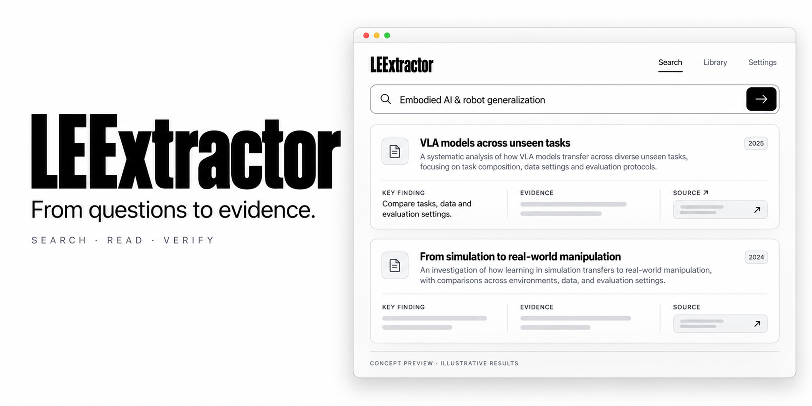

# LEExtractor

[简体中文](README.zh-CN.md) · **English**

From research questions to traceable literature evidence.

**v0.9.11** connects the v0.9.6 interface design to the v0.9.5 algorithms with Vue 3, Vuetify and a local FastAPI service. The existing Streamlit and MCP entries remain available.

## Get started

Install 64-bit Python 3.10+ (3.12 recommended) with Python on PATH. Download and fully extract the [`feature/web-backend-integration` branch](https://github.com/26Wesly3/LEExtractor/tree/feature/web-backend-integration) via Code → Download ZIP; this version has not been merged into master.

On Windows, double-click **启动LEExtractor.bat** (or **启动Web版.bat**). It creates `.venv`, installs Python dependencies, prepares both local models (downloading missing files), and opens http://127.0.0.1:8000. Keep the window open during the first download. Subsequent launches reuse the cache. The GitHub source and releases include the built interface; running does not require Node.js, a GPU or an inference API key.

The standard source ZIP excludes weights. The separate model-inclusive handoff ZIP contains all runtime weights and tokenizers; the launcher automatically selects its `models` directory. Initial Python dependency installation and actual literature retrieval still require internet access.

Manual startup (Windows PowerShell, from the project root):

```powershell
python -m venv .venv
.\.venv\Scripts\python.exe -m pip install -e ".[web]" -c constraints.txt
.\.venv\Scripts\python.exe scripts\launch_web.py --port 8000
```

On macOS/Linux, create and activate a Python virtual environment, install the same dependencies, and run `python scripts/launch_web.py --port 8000`. Add `--skip-models` to open the UI without preparing models. Preparation failures are reported and leave the UI available for manual English queries and lexical ranking. If the browser does not open, visit the URL manually. Use `启动Web版.bat --port 8001` for an occupied port; Ctrl+C stops the service.

Use **Create offline demo** to explore a separate, clearly labeled synthetic project. For research, create a regular project and configure provider credentials in Settings or a local environment file. Provider availability and rate limits affect coverage.

## Local research translation and semantic ranking

The Web workflow translates Chinese research directions with a local quantized Marian model and lets you edit the English query. The direction drives both retrieval and ranking. CPU FastEmbed uses `sentence-transformers/paraphrase-multilingual-MiniLM-L12-v2`, encoding titles together with abstract chunks. Missing abstracts are labeled. Runtime files total about 116 MB for translation and 267 MB for embeddings including tokenizers. Pinned revisions and SHA-256 inventories are in `litsearch/translation_pins.json` and `litsearch/embedding_pins.json`.

Translation normally uses `~/.cache/leextractor`; embeddings reuse `fastembed_cache` under the system temporary directory. Override them with `LEEXTRACTOR_MODEL_DIR` and `LEEXTRACTOR_EMBEDDING_CACHE`. Bundled models are selected automatically unless these variables are already set. See the [handoff](交接说明_v0.9.11.md) for contents and acceptance results.

Six selectable providers include OpenReview public submissions and Google Scholar via SerpApi. CCF 2026 venue classifications support A/B/C filtering; venue rank does not verify paper acceptance or full-paper eligibility. Google Scholar requires a SerpApi key and is selected by default only when configured. Its snippets are not full abstracts. Provider rate limits and access challenges can prevent retrieval; coverage is not guaranteed.

## Current workflow

1. Enter a topic, research direction and year range. Inspect the backend query plan before starting a search.
2. Browse and filter actual project records, inspect metadata, discovery trails and the context of relevance scores.
3. Select seeds for citation expansion or BC/CC similarity. Background tasks expose real stage/count progress, request budgets and cancellation.
4. Inspect the corpus landscape and graph paths; review evidence-linked candidate questions.
5. Make human screening decisions, label calibration examples and obtain available open full texts.
6. Export CSV, RIS, BibTeX, session JSON, PRISMA flow data or an evidence pack. Restore sessions as separate projects.

Project state, task checkpoints and generated files are stored locally in `.web-data`. Browser tabs use revision checks to prevent stale overwrites. The service binds to loopback and does not provide accounts or authentication for a public multiuser deployment.

Search queries and publication identifiers are sent to the selected literature providers. Full-text requests go to open-access sources. Credential responses contain configured flags only. This version does not call an LLM service. Removing the local data directory after stopping the service removes saved Web projects and exports.

## Scope and evidence

Relevance is a local semantic and lexical ranking signal, not a screening decision or proof of research quality. Citation edges and derived similarity relations are counted separately. Failed, canceled, budget-limited and truncated retrievals remain distinguishable. Full-text inclusion requires a human reading confirmation.

Local title-and-abstract embeddings rerank provider candidates; they cannot recover papers absent from upstream results. Automated full-text synthesis, innovation scoring and Zotero synchronization are planned. Candidate questions and clusters summarize the available corpus; they are not verified scientific conclusions. Counts describe records/reports rather than deduplicated studies.

The following earlier concept image is illustrative, not a screenshot of current results:



## Development and validation

Benchmark pilot: see [public SciFact ranking comparisons, live topic snapshots and human annotation](benchmarks/PILOT_GUIDE.md). Run `python -m scripts.run_public_benchmark --queries 30` for per-system JSON, CSV and Markdown metrics using public qrels; synthetic sample labels are not competition results.

[First pilot results and handoff, 2026-10-10](benchmarks/results/scifact-pilot-2026-10-10/SUMMARY.zh-CN.md): 5,183 candidates and 30 seeded test questions, with frozen rankings and per-query metrics for offline rescoring.

- [Setup and current capabilities](README.dev.md)
- [Web integration and API boundaries](docs/web-integration.md)
- [Current validation](VALIDATION_v0.9.11.md)
- [Architecture](ARCHITECTURE.md), [changes](CHANGES.md), [roadmap](ROADMAP.md), [team handoff](ONBOARDING.md)

Frontend development: `cd web`, `npm ci`, `npm run dev`; start FastAPI separately on port 8000. The Vite proxy forwards `/api`. Before releasing, run `npm run build`, then `python scripts/sync_web_assets.py` from the repository root.

Report issues with the version, reproduction steps, expected result and actual result. Remove secrets from shared logs and sessions.

## Contributors

[GlueGPT](https://github.com/GlueGPT) · [jvligyh](https://github.com/jvligyh)

Publication content and third-party data remain subject to their respective terms. A repository code license has not yet been selected.
